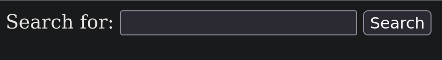
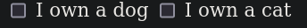

# form helpers

## basic forms

`form_with`

```html

<%= form_with do |form| %>
<% end %>

<!-- renders -->
<form action="/books/new" accept-charset="UTF-8" method="post">
  <input type="hidden" name="authenticity_token" value="rIBMMpNKzvMZbBuoc83gFmupQSNBFctudLZNg7lTCTj4fW7rpqO_mf_BP4qnYx_A83u-tWTwag5WoL3wbtPZmQ" autocomplete="off" />
</form>
```

the `authenticity_token` field is a code for preventing CSRF attacks

a search form contains

- form element with a GET method
- a label for input
- text input element
- submit button

```html
<%= form_with url: '/search', method: :get do |form| %>
  <%= form.label :query, 'Search for: ' %>
  <%= form.text_field :query %>
  <%= form.submit 'Search' %>
<% end %>

<!-- renders -->
<form action="/search" accept-charset="UTF-8" method="get">
  <label for="query">Search for: </label>
  <input type="text" name="query" id="query" />
  <input type="submit" name="commit" value="Search" data-disable-with="Search" />
</form>
<!-- params = { action: 'controller_action', controller: 'controller_name', commit: 'submit_button_value' } -->
```



we can also pass an object to `url:` option

for every `input` tag the `id` attribute is inferred from the `name`

NOTE: Use "GET" as the method for search forms. This allows users to bookmark a specific search and get back to it. More generally Rails encourages you to use the right HTTP verb for an action.

### some form helpers

- checkbox

  ```html
  <%= form.check_box :pet_dog %>
  <%= form.label :pet_dog, "I own a dog" %>
  <%= form.check_box :pet_cat %>
  <%= form.label :pet_cat, "I own a cat" %>

  <!-- renders -->
  <input name="pet_dog" type="hidden" value="0" autocomplete="off" />
  <input type="checkbox" value="1" name="pet_dog" id="pet_dog" />
  <label for="pet_dog">I own a dog</label>
  <input name="pet_cat" type="hidden" value="0" autocomplete="off" />
  <input type="checkbox" value="1" name="pet_cat" id="pet_cat" />
  <label for="pet_cat">I own a cat</label>
  <!-- params = { pet_dog: [0/1], pet_cat: [0/1] } -->

  <!-- but this also renders hidden input with value of 0 -->
  <!-- to not have this we need to add include_hidden: false -->

  <%= form.check_box :pet_dog, include_hidden: false %>
  <%= form.label :pet_dog, "I own a dog" %>
  <%= form.check_box :pet_cat, include_hidden: false %>
  <%= form.label :pet_cat, "I own a cat" %>

  <input type="checkbox" id="pet_dog" name="pet_dog" value="1" />
  <label for="pet_dog">I own a dog</label>
  <input type="checkbox" id="pet_cat" name="pet_cat" value="1" />
  <label for="pet_cat">I own a cat</label>
  <!-- params = { pet_dog: [nil/1], pet_cat: [nil/1] } -->

  <!-- if we do not have the hidden value the params value of the unchecked boxes is nil -->
  ```

  

- radio buttons

  ```html
  <%= form.radio_button :age, "child" %>
  <%= form.label :age_child, "I am younger than 21" %>
  <%= form.radio_button :age, "adult" %>
  <%= form.label :age_adult, "I am over 21" %>

  <input type="radio" id="age_child" name="age" value="child" />
  <label for="age_child">I am younger than 21</label>
  <input type="radio" id="age_adult" name="age" value="adult" />
  <label for="age_adult">I am over 21</label>
  <!-- params = { age: [child/adult] } -->
  ```

- other helpers

```html
<%= form.text_area :message, size: "70x5" %>
<!-- params = { message: 'message in text box' } -->

<%= form.hidden_field :parent_id, value: "foo" %>
<!-- params = { parent_id: 'foo' } -->

<%= form.password_field :password %>
<!-- params = { password: 'password_plain_text' } -->

<%= form.number_field :price, in: 1.0..20.0, step: 0.5 %>
<!-- params = { price: 6.5 } -->
<!-- increases price between the range given in :in option in increments defined in :step option -->

<%= form.range_field :discount, in: 1..100 %>
<!-- params = { discount: 89 } -->
<!-- makes a slider with range given in the :in option -->

<%= form.date_field :born_on %>
<!-- params = { born_on: 'YYYY-MM-DD' } -->

<%= form.time_field :started_at %>
<!-- params = { started_at: 'HH:MM' } -->

<%= form.datetime_local_field :graduation_day %>
<!-- params = { graduation_day: '2023-04-07T13:03' } -->

<%= form.month_field :birthday_month %>
<%= form.week_field :birthday_week %>
<!-- the above 2 seem like normal text fields -->
<!-- params = { birthday_month: 'month_name', birthday_week: week_number } -->

<%= form.search_field :name %>
<%= form.email_field :address %>
<%= form.telephone_field :phone %>
<%= form.url_field :homepage %>
<!-- seem like normal text fields although the email_field and url_field have browser-validations on them -->
<!-- params = { name: 'name', address: 'email_id', phone: 'ph_no', homepage: 'url' } -->

<%= form.color_field :favorite_color %>
<!-- color picker field -->
<!-- params = { favorite_color: 'color_hex_code' } -->
```

NOTE: The search, telephone, date, time, color, datetime, datetime-local, month, week, URL, email, number, and range inputs are HTML5 controls. If you require your app to have a consistent experience in older browsers, you will need an HTML5 polyfill (provided by CSS and/or JavaScript). There is definitely no shortage of solutions for this, although a popular tool at the moment is Modernizr, which provides a simple way to add functionality based on the presence of detected HTML5 features.

NOTE: If you're using password input fields (for any purpose), you might want to configure your application to prevent those parameters from being logged. You can learn about this in the Securing Rails Applications guide.

## dealing with model objects

### binding form to a model object

we can use the `:model` option in a `form_with` method to bind the form builder to the object

if the object is a new record, the form action is directed to the create method, otherwise it is directed to the update method

```html
<%= form_with model: book do |form|%>
  <%= form.label :name %>
  <%= form.text_field :name, value: book.name%>
  <br>
  <%= form.label :isbn, 'ISBN' %>
  <%= form.text_field :isbn, value: book.isbn %>
  <br>
  <%= form.label :price %>
  <%= form.number_field :price, step: 0.01 %>
  <br>
  <%= form.submit  %>
<% end %>
```

in the request the params are like this `params: { book: { name: 'name', isbn: 'isbn', price: 'price' } }`

- `fields_for`

  this method makes a type of sub form inside the form with a seperate entry in the params hash

  ```html
  <%= form_with model: book do |form|%>
    <%= form.label :name %>
    <%= form.text_field :name, value: book.name%>
    <br>
    <%= fields_for :isbn, book.isbn do |isbn_form| %>
      <%= isbn_form.label :isbn, 'ISBN' %>
      <%= isbn_form.text_field :isbn %>
    <% end %>
    <br>
    <%= form.label :price %>
    <%= form.number_field :price, step: 0.01 %>
    <br>
    <%= form.submit  %>
  <% end %>
  ```

  the params hash for this request are like this `params: { book: {name: 'name', price: 'price'}, isbn: { isbn: 'isbn' } }`

- singular resource

  If you have a singular resource, you will need to call resource and resolve for it to work with `form_with`:

  singular resources are those which have a singular name as in the name of the class has only one object

  ```ruby
  resource :geocoder
  resolve('Geocoder') { [:geocoder] }
  ```

- namespaces
  `form_with model: [:admin, @article]`

  for `/admins/12/articles/new`

  `form_with model: [:admin, :management, @article]`

  for `/admins/12/managements/1/articles/new`

### other http verb forms

only GET and POST are implemented by browser forms, to emulate the other http verbs by putting a hidden input with the name `_method` with the value of the http verb which we want

```ruby
<%= form_with(url: search_path, method: "patch") %>

<form accept-charset="UTF-8" action="/search" method="post">
  <input name="_method" type="hidden" value="patch" />
  <input name="authenticity_token" type="hidden" value="f755bb0ed134b76c432144748a6d4b7a7ddf2b71" />

  <!-- ... -->
</form>
```

when parsing this data rails will see the `_method` name tag and parse this request as if it vere sent to that verb

we can also have a button which overrides the method specified in the form, for eample if you want to have 2 buttons in a form one to update the object and the other to delete the object, we do this in rails by using the `:formmethod` option

```html
<%= form_with url: "/posts/1", method: :patch do |form| %>
  <%= form.button "Delete", formmethod: :delete, data: { confirm: "Are you sure?" } %>
  <%= form.button "Update" %>
<% end %>


<form accept-charset="UTF-8" action="/posts/1" method="post">
  <input name="_method" type="hidden" value="patch" />
  <input name="authenticity_token" type="hidden" value="f755bb0ed134b76c432144748a6d4b7a7ddf2b71" />
  <!-- ... -->

  <button type="submit" formmethod="post" name="_method" value="delete" data-confirm="Are you sure?">Delete</button>
  <button type="submit" name="button">Update</button>
</form>
```

## making select boxes easily

```html
<%= form.select :city, ["Berlin", "Chicago", "Madrid"] %>

<select name="city" id="city">
  <option value="Berlin">Berlin</option>
  <option value="Chicago">Chicago</option>
  <option value="Madrid">Madrid</option>
</select>
<!-- params = { city: 'Madrid' } -->
```

we can also give options which are different from their labels

```html
<%= form.select :city, [["Berlin", "BE"], ["Chicago", "CHI"], ["Madrid", "MD"]] %>

<select name="city" id="city">
  <option value="BE">Berlin</option>
  <option value="CHI">Chicago</option>
  <option value="MD">Madrid</option>
</select>
<!-- params = { city: 'MD' } -->
```

we can also specify the default selected choice

```html
<%= form.select :city, [["Berlin", "BE"], ["Chicago", "CHI"], ["Madrid", "MD"]], selected: 'CHI' %>

<select name="city" id="city">
  <option value="BE">Berlin</option>
  <option value="CHI", selected="CHI">Chicago</option>
  <option value="MD">Madrid</option>
</select>
```

- option groups

```html
<%= form.select :city,
      {
        "Europe" => [ ["Berlin", "BE"], ["Madrid", "MD"] ],
        "North America" => [ ["Chicago", "CHI"] ],
      },
      selected: "CHI" %>

<select name="city" id="city">
  <optgroup label="Europe">
    <option value="BE">Berlin</option>
    <option value="MD">Madrid</option>
  </optgroup>
  <optgroup label="North America">
    <option value="CHI" selected="selected">Chicago</option>
  </optgroup>
</select>
<!-- params = { city: 'CHI' } -->
```

- select boxes with model objects

when we give any field with an object the object name gets superscripted into the params including options

```ruby
@person = Person.new(city: "MD")
```

```html
<%= form_with model: @person do |form| %>
  <%= form.select :city, [["Berlin", "BE"], ["Chicago", "CHI"], ["Madrid", "MD"]] %>
<% end %>

<select name="person[city]" id="person_city">
  <option value="BE">Berlin</option>
  <option value="CHI">Chicago</option>
  <option value="MD" selected="selected">Madrid</option>
</select>
<!-- params = { person: { city: 'MD' } } -->
```

selected city gets selected automatically

- timezone select

rails already has a class `ActiveSupport::Timezone` which has different timezone instances, `form.time_zone_select` will give us a selection of timezones

```html

<%= form.time_zone_select :time_zone %>

<select name="time_zone" id="time_zone">
  <option value="International Date Line West">(GMT-12:00) International Date Line West</option>
  .
  .
  .
</select>

<!-- params = { time_zone: 'New Delhi' } -->
```

## date and time form helpers

if we dont want to use HTML5 `date_field` and `time_field` inputs we can use these alternate helpers which just render select boxes

```ruby
@book = Book.first
```

```html
<%= form_with model: @book do |form| %>
  <%= form.date_select :created_at %>
<%end%>

<select name="book[created_at(1i)]" id="book_created_at_1i">
  <option></option>
    ...
  <!-- +- 5 years of given year -->
</select>
<select name="book[created_at(2i)]" id="book_created_at_2i">
  <option></option>
    ...
  <!-- 12 Months of the year -->
</select>
<select name="book[created_at(3i)]" id="book_created_at_3i">
  <option></option>
    ...
  <!-- 1-31 corresponding to the days -->
</select>

each of the above options have selected="selected" on the current date given

if it is not given then defaults to today's date
```

- select boxes for induvidual time components
Rails also provides helpers to render select boxes for individual temporal components: `select_year`, `select_month`, `select_day`, `select_hour`, `select_minute`, and `select_second`. These helpers are "bare" methods, meaning they are not called on a form builder instance. For example:

```html
<%= select_year 1999, prefix: "party" %>

<select name="party[year]" id="party_year">
  <option value="1994">1994</option>
  <option value="1995">1995</option>
  <option value="1996">1996</option>
  <option value="1997">1997</option>
  <option value="1998">1998</option>
  <option value="1999" selected="selected">1999</option>
  <option value="2000">2000</option>
  <option value="2001">2001</option>
  <option value="2002">2002</option>
  <option value="2003">2003</option>
  <option value="2004">2004</option>
</select>
```

if we add this outside a form, the params do not contain anything whern said form is submitted, but if it is in a form, when the form is submitted, there is also a `:party` key inside the params hash

## choices from a collection of arbitrary objects

### `collection_select`

```html
<%= form.collection_select :city_id, City.order(:name), :id, :name %>

<select name="city_id" id="city_id">
  <option value="3">Berlin</option>
  <option value="1">Chicago</option>
  <option value="2">Madrid</option>
</select>
params = { city_id: 2 }
```

NOTE: With `collection_select` we specify the value method first (`:id` in the example above), and the text label method second (`:name` in the example above). This is opposite of the order used when specifying choices for the `select` helper, where the text label comes first and the value second.

### `collection_radio_buttons`

```html
<%= form.collection_radio_buttons :id, City.order(:name), :id, :name %>

<input type="radio" name="city[id]" value="3" id="city_id_3">
<label for="city_id_3">Berlin</label>
<input type="radio" name="city[id]" value="1" id="city_id_1">
<label for="city_id_1">Chicago</label>
<input type="radio" name="city[id]" value="2" id="city_id_2">
<label for="city_id_2">Madrid</label>


<!-- we cannot give :city_id, it gives error that no method :city_id on City  if we are making model form for City model otherwise we can do this-->

<%= form.collection_radio_buttons :city_id, City.order(:name), :id, :name %>


<input type="radio" name="city_id" value="3" id="city_id_3">
<label for="city_id_3">Berlin</label>
<input type="radio" name="city_id" value="1" id="city_id_1">
<label for="city_id_1">Chicago</label>
<input type="radio" name="city_id" value="2" id="city_id_2">
<label for="city_id_2">Madrid</label>
params = { city_id: 2 }
```

### `collection_check_boxes

```html
<%= form.collection_check_boxes :city_id, City.order(:name), :id, :name %>

<input type="checkbox" name="city_id[]" value="3" id="city_id_3">
<label for="city_id_3">Berlin</label>
<input type="checkbox" name="city_id[]" value="1" id="city_id_1">
<label for="city_id_1">Chicago</label>
<input type="checkbox" name="city_id[]" value="2" id="city_id_2">
<label for="city_id_2">Madrid</label>

<!-- as with the above example :city_id must be changed to :id when using form_with model: @city -->

```

## uploading files

```html
<%= form_with model: @person do |form| %>
  <%= form.file_field :picture %>
<% end %>
<!-- params = { person: { picture: #<ActionDispatch::Http::UploadedFile> } } -->

<!-- this makes the enctype field of the form `multipart/formdata` by default, if we want to do manually, we must do this -->

<%= form_with url: "/uploads", multipart: true do |form| %>
  <%= file_field_tag :picture %>
<% end %>
<!-- params = { picture: #<ActionDispatch::Http::UploadedFile> } -->

<!-- both create a form with multipart encoding and an input tag of type file -->

```

The object in the params hash is an instance of ActionDispatch::Http::UploadedFile. The following snippet saves the uploaded file in `#{Rails.root}/public/uploads` under the same name as the original file.

```ruby
def upload
  uploaded_file = params[:picture]
  File.open(Rails.root.join('public', 'uploads', uploaded_file.original_filename), 'wb') do |file|
    file.write(uploaded_file.read)
  end
end
```

Once a file has been uploaded, there are a multitude of potential tasks, ranging from where to store the files (on Disk, Amazon S3, etc), associating them with models, resizing image files, and generating thumbnails, etc. Active Storage is designed to assist with these tasks.

## customizing form builders

the object yielded inside the `form_with` block is an instance of `ActionView::Helpers::FormBuilder` if we want to monkeypatch some functionality in the instance methods of this class we can create a subclass of it and define our own methods there

```ruby
class SomeTextFormBuilder < ActionView::Helpers::FormBuilder
  def text_field
    '<h1> Hello World </h1>'
  end
end
```

to use it we can do pass the `:builder` option in the `form_with` method

```html
<%= form_with builder: SomeTextFormBuilder, url: '/books/', method: :post do |form| %>
  <%= form.text_field %> <br>
  <%= form.collection_radio_buttons :letters, ['a', 'b', 'c'], :length, :size %> <br>
  <%= form.submit %>
<% end %>


<form action="/books/" accept-charset="UTF-8" method="post"><input type="hidden" name="authenticity_token" value="5FNkq6Wg3o9F05DkJ-jNdic77nFDLl9rx5InckHk2Bjmq3bODn3-9nI_ZD46gBAlaBRMwo6pz49cXtKkhpRpYA" autocomplete="off" />
  &lt;h1&gt; Hello World &lt;/h1&gt; <br>
  <input type="hidden" name="letters" value="" autocomplete="off" /><input type="radio" value="1" name="letters" id="letters_1" /><label for="letters_1">1</label><input type="radio" value="1" name="letters" id="letters_1" /><label for="letters_1">1</label><input type="radio" value="1" name="letters" id="letters_1" /><label for="letters_1">1</label> <br>
  <input type="submit" name="commit" value="Save " data-disable-with="Save " />
</form>
```

if we want to use the options passed in we have to make them in the cotext of the calling object of the form by calling `objectify_options` so that it will be correctly passed to params

```ruby
class MyFormBuilder < ActionView::Helpers::FormBuilder
  def div_radio_button(method, tag_value, options = {})
    @template.content_tag(:div,
      @template.radio_button(
        @object_name, method, tag_value, objectify_options(options)
      )
    )
  end
end
```

```html
<%= form_for @person, :builder => MyFormBuilder do |f| %>
  I am a child: <%= f.div_radio_button(:admin, "child") %>
  I am an adult: <%= f.div_radio_button(:admin, "adult") %>
<% end -%>
```

The form builder used also determines what happens when you do:

```html
<%= render partial: f %>
```

If f is an instance of `ActionView::Helpers::FormBuilder`, then this will render the form partial, setting the partial's object to the form builder. If the form builder is of class `LabellingFormBuilder`, then the `labelling_form` partial would be rendered instead.

## parameter naming convention

```html
<input id="person_name" name="person[name]" type="text" value="Henry"/>
<!-- {'person' => {'name' => 'Henry'}} -->

<input id="person_address_city" name="person[address][city]" type="text" value="New York"/>
<!-- {'person' => {'address' => {'city' => 'New York'}}} -->


<input name="person[phone_number][]" type="text"/>
<input name="person[phone_number][]" type="text"/>
<input name="person[phone_number][]" type="text"/>
<!-- { person: { phone_number: ['231232', '123421', '12122334'] } } -->

<input name="person[addresses][][line1]" type="text"/>
<input name="person[addresses][][line2]" type="text"/>
<input name="person[addresses][][city]" type="text"/>
<input name="person[addresses][][line1]" type="text"/>
<input name="person[addresses][][line2]" type="text"/>
<input name="person[addresses][][city]" type="text"/>
<!-- {
  person: {
    addresses: [
      { line1: '1234', line2: '1212', city: 'noida' },
      { line1: '1213', line2: '1214', city: 'delhi' },
    ]
  }
} -->

<!--
  hashes can be nested arbitrarily bu arrays can only be nested once 

  so person[addresses][][][line1][][][][l2] will be:
  person[addresses][][line1][][l2]

  params = {
    person: {
      addresses: [
        {
          line1:[
            {
              l2: 'value'
            }
          ]
        }
      ]
    }
  }
-->
```

NOTE: Array parameters do not play well with the `check_box` helper. According to the HTML specification unchecked checkboxes submit no value. However it is often convenient for a checkbox to always submit a value. The check_box helper fakes this by creating an **auxiliary hidden input with the same name**. If the checkbox is unchecked only the hidden input is submitted and if it is checked then both are submitted but the value submitted by the checkbox takes precedence.

in the `fields_for` helper we can add an `:index` option

Let's say we want to render a form with a set of fields for each of a person's addresses

```html
<%= form_with model: @person do |person_form| %>
  <%= person_form.text_field :name %>
  <% @person.addresses.each do |address| %>
    <%= person_form.fields_for address, index: address.id do |address_form| %>
      <%= address_form.text_field :city %>
    <% end %>
  <% end %>
<% end %>

<!-- Assuming the person has two addresses with IDs 23 and 45, the above form would render output similar to: -->

<form accept-charset="UTF-8" action="/people/1" method="post">
  <input name="_method" type="hidden" value="patch" />
  <input id="person_name" name="person[name]" type="text" />
  <input id="person_address_23_city" name="person[address][23][city]" type="text" />
  <input id="person_address_45_city" name="person[address][45][city]" type="text" />
</form>

<!-- params = {
  person: {
    addresses: [
      23: { city: 'noida' },
      45: { city: 'delhi' }
    ]
  }
} -->
```

## forms to external resorces

Rails' form helpers can also be used to build a form for posting data to an external resource. However, at times it can be necessary to set an authenticity_token for the resource; this can be done by passing an `authenticity_token: 'your_external_token'` parameter to the form_with options:

```html
<%= form_with url: 'http://farfar.away/form', authenticity_token: 'external_token' do %>
  Form contents
<% end %>
```

Sometimes when submitting data to an external resource, like a payment gateway, the fields that can be used in the form are limited by an external API and it may be undesirable to generate an `authenticity_token`. To not send a token, simply pass `false` to the `:authenticity_token` option:

```html
<%= form_with url: 'http://farfar.away/form', authenticity_token: false do %>
  Form contents
<% end %>
```

## building complex forms

Many apps grow beyond simple forms editing a single object. For example, when creating a Person you might want to allow the user to (on the same form) create multiple address records (home, work, etc.). When later editing that person the user should be able to add, remove, or amend addresses as necessary.

### configuring the model

we can use `accept_nested_attributes`

```ruby
class Person < ApplicationRecord
  has_many :addresses, inverse_of: :person

  # we can add the allow_destroy: true option to the below line to allow the parent to destroy the child on save
  # when we set the child's :_destroy attribute to true the child is marked_for_destruction
  # when we save the parent, the child is automatically destroyed
  # we can also add reject_if: ->(attributes) { attribute['kind'].blank? }
  # or a shorthand reject_if: :all_blank

  accepts_nested_attributes_for :addresses
end

class Address < ApplicationRecord
  belongs_to :person
end
```

in the controllers we can do this

```ruby
def create
  @person = Person.new(person_params)
  # ...
end

def destroy
  # ...
end

private

  def person_params
    params.require(:person).
      permit(:name, addresses_attributes: [:id, :kind, :street, :_destroy])
  end
end
```

new view

```html
<%= form_with model: @person do |form| %>
  Addresses:
  <ul>
    <%= form.fields_for :addresses do |addresses_form| %>
      <li>
        <%= addresses_form.label :kind %>
        <%= addresses_form.text_field :kind %>

        <%= addresses_form.label :street %>
        <%= addresses_form.text_field :street %>
        ...
      </li>
    <% end %>
  </ul>
<% end %>
```

update view with deletions for address fields present

```html
<%= form_with model: @person do |form| %>
  Addresses:
  <ul>
    <%= form.fields_for :addresses do |addresses_form| %>
      <li>
        <%= addresses_form.check_box :_destroy %>
        <%= addresses_form.label :kind %>
        <%= addresses_form.text_field :kind %>
        ...
      </li>
    <% end %>
  </ul>
<% end %>
```

- adding new fields on the fly
  Rather than rendering multiple sets of fields ahead of time you may wish to add them only when a user clicks on an "Add new address" button. Rails does not provide any built-in support for this. When generating new sets of fields you must ensure the key of the associated array is unique - the current JavaScript date (milliseconds since the epoch) is a common choice.

## Using Tag Helpers Without a Form Builder

In case you need to render form fields outside of the context of a form builder, Rails provides tag helpers for common form elements. For example, check_box_tag:

```html
<%= check_box_tag "accept" %>

Output:

<input type="checkbox" name="accept" id="accept" value="1" />
```

Generally, these helpers have the same name as their form builder counterparts plus a _tag suffix.

## Using `form_tag` and `form_for`

Before `form_with` was introduced in Rails 5.1 its functionality used to be split between `form_tag` and `form_for`. Both are now soft-deprecated.
